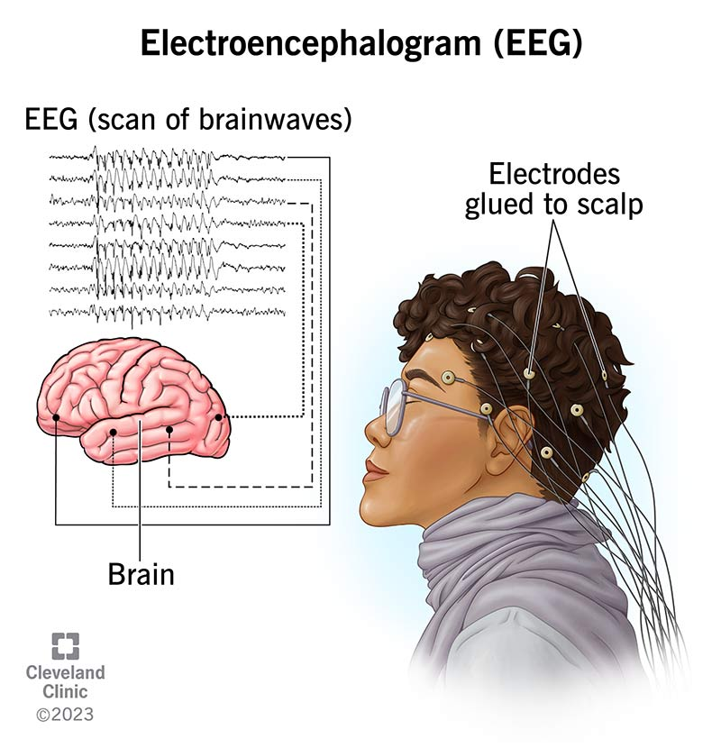

# Brainwaves to Pixels: Notes on EEG-Based Image Reconstruction

## Access the Website

The website is built using MkDocs and hosted on GitHub Pages. You can access it here:
[Brainwaves to Pixels](https://ignisavium.github.io/Brainwaves-to-Pixels-Notes-EEG2img/index.html)

## About

Hi~😉 I’m Ignisavium, a student passionate about EEG-based image reconstruction. These notes are part of my ongoing effort to organize and share knowledge on this fascinating topic. Feel free to explore my work or contribute on GitHub: [@ignisavium ](https://github.com/ignisavium). 

### Key Topics Covered

- 🧠**Introduction**: Basics of EEG and image reconstruction techniques. 
- 📘**Papers & Methods**: Insights from seminal studies and algorithms.
- 🤔**Reflections**: Limitations and future directions in the field.

In recent years, **Diffusion Model** has gradually become the mainstream of generative models due to its excellent performance and convenient integration features. Here we mainly focus on the **EEG to Image reconstruction** method based on diffusion.
