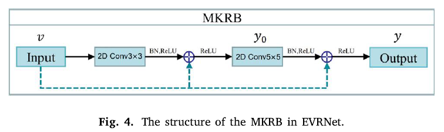
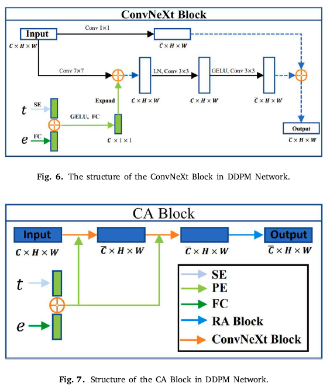

# DM-RE2I: A framework based on diffusion model for the reconstruction from EEG to image

---

## 🔥INFO

**Blog**: 2025/07/19 by IgniSavium

- **Title**: DM-RE2I: A framework based on diffusion model for the reconstruction from EEG to image
- **Authors**:  Hong Zeng, Wanzeng Kong et.al (Hangzhou Dianzi University, University of Yamanashi)
- **Published**: October 2023
- **Comment**: Biomedical Signal Processing and Control
- **URL**: https://www.sciencedirect.com/science/article/abs/pii/S174680942300558X

🥜**TLDR**: TSConv + guided DDPM

---

## Motivation

The paper aims to address the challenge of reconstructing high-quality, semantically accurate images from EEG signals—which suffer from **low signal-to-noise ratio** and **individual variability**—by proposing a novel diffusion-model-based framework (DM-RE21) that combines a robust EEG semantic feature extractor (EVRNet - one residual net) and a denoising diffusion module (EG-DDPM), overcoming the limitations of previous LSTM, CNN, VAE, and GAN-based approaches in terms of semantic fidelity, resolution, and generalizability.

## Model

### EEG Encoder

### Image Decoder

