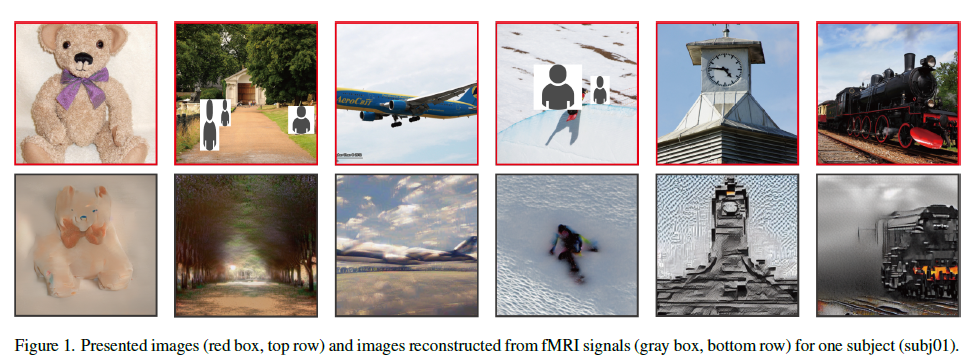

# High-resolution image reconstruction with latent diffusion models from human brain activity

---

## 🔥INFO

**Blog**: 2025/07/21 by IgniSavium

- **Title**: High-resolution image reconstruction with latent diffusion models from human brain activity
- **Authors**: Yu Takagi, Shinji Nishimoto (Osaka University)
- **Published**: March 2023
- **Comment**: CVPR
- **URL**: https://www.biorxiv.org/content/10.1101/2022.11.18.517004v3

🥜**TLDR**: Image reconstruction via training-free latent diffusion models ( Stable Diffusion) with fMRI inputs.

---

## Motivation

This research aims to improve the reconstruction of **high-resolution**, semantically accurate images from human brain activity (fMRI) using **training-free** **latent diffusion models (LDMs)**, addressing the limitations of previous deep generative models that required complex training and fine-tuning, by offering a more efficient and **interpretable** method with minimal computational cost.

## Model

### Architecture

Overall a **Latent Diffusion Model** framework (actually `Stable Diffusion` ):
 $ \epsilon $ denotes an image encoder, $ D $ is a image decoder (they are a pair of autoencoder). 

only train 2 (small linear) parts:

(1) fMRI -> original image latent $z$  (a simple coarse network approximation)

(2) fMRI -> conditional "text" (i.e. semantic) $c$

## Evaluation

 No comparable previous work exists, so this paper almost only provides ablation and visualization analysis.

### Ablation

Perceptual Similarity Metrics (PSMs):

$z$ represents the low-level semantics, and $c$ captures the high-level abstraction semantics.

##  Reverse Encoding Visualization

 Reversely map the features or components in the LDM BACK INTO the fMRI inputs (to find semantic relationships).

####  $z,c,z_c$ feature

Different latent representations (z, c, and $z_c$) show varying prediction performance across visual cortex regions, with z performing well in early visual cortex, c excelling in higher visual cortex, and $z_c$ closely resembling z in its performance, despite representing visually different images

#### $z,c$  semantic balancing with varying noise level

 As noise levels increased, the latent representation with added noise ($z_c$) predicted voxel activity in higher visual cortex better (🤔thanks to high-level condition $c$) than the original representation ($z$)

#### $z, c$ semantic balancing at different denoising timesteps

 During the denoising process, early stages were dominated by the original image representation (z), while mid-stages saw the noise-added representation ($z_c$) ( 🤔thanks to high-level condition $c$) better predict activity in higher visual cortex.

#### denoise network per-layer semantic interpretation

The U-Net bottleneck layer initially captures the most information across the cortex, but as denoising progresses, **early U-Net layers** become more predictive of **early visual cortex** activity while the **bottleneck layer** shifts to representing **higher-level semantic information** in higher visual areas.

