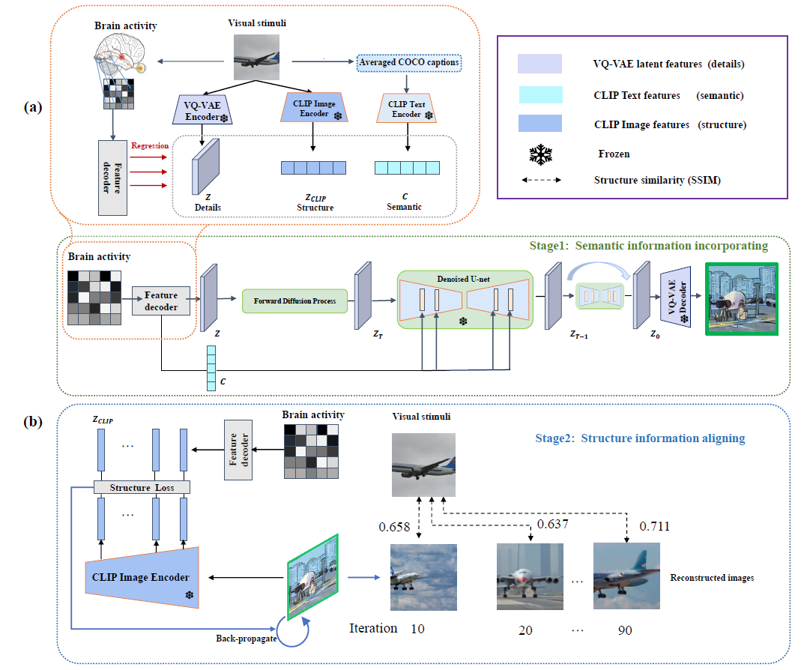
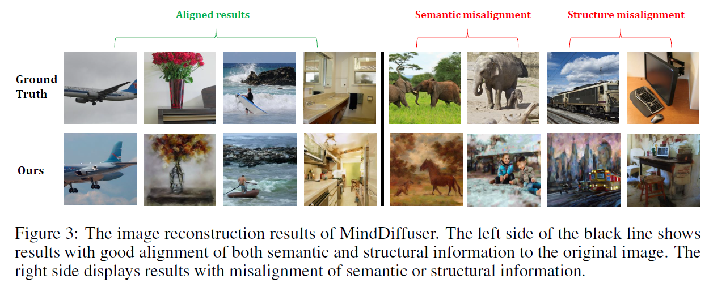
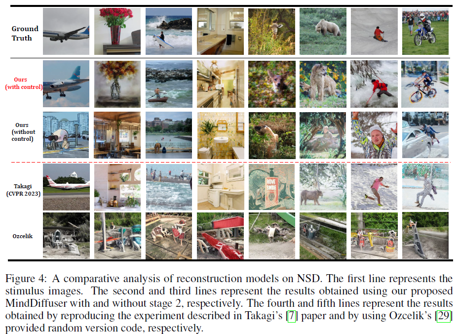

# MindDiffuser-Controlled Image Reconstruction from Human Brain Activity with Semantic and Structural Diffusion

---

## 🔥INFO

**Blog**: 2025/07/21 by IgniSavium

- **Title**: MindDiffuser-Controlled Image Reconstruction from Human Brain Activity with Semantic and Structural Diffusion
- **Authors**: Yizhuo Lu, Huiguang He et al. (CAS)
- **Published**: March 2023
- **Comment**: ACM Multimedia
- **URL**: https://arxiv.org/abs/2303.14139

🥜**TLDR**: Preserve structural information in fMRI-to-image reconstruction by iteratively backpropagating Stable Diffusion inputs guided by CLIP **low-layer** feature supervision.

---

## Motivation

The research aims to address the challenge of reconstructing visual stimuli from fMRI data by developing a **two-stage** model (based on Stable Diffusion)  that simultaneously ensures semantic richness and structural alignment, overcoming limitations in previous methods that either lacked clear semantic details or **controlled structural features like position and orientation**.

## Model

### Architecture

Stage-1: linear transform fMRI into original visual latent state $z$ and text condition $c$ in **Stable Diffusion img2img** process.

Stage-2: iteratively **backpropagate** $z,c$ to **align** the **lower CLIP layer features** (which contains structural information such as position and orientation) between generated images and original images (extracted via trained linear transformation from fMRI)

## Evaluation

### Performance

- CLIP last layer cosine similarity for semantic comparison

#### SSIM (Structural Similarity Index Measure)

- **From -1 to 1**, but typically **between 0 and 1**;
- **1 indicates that the two images are structurally identical**.

$$
SSIM(x,y)=\frac{(2\mu_x\mu_y + C_1)(2\sigma_{xy} + C_2)}{(\mu_x^2 + \mu_y^2 + C_1)(\sigma_x^2 + \sigma_y^2 + C_2)}
$$

Where:

- $\mu_x, \mu_y$: The mean values (brightness) of images $x$ and $y$;
- $\sigma_x^2, \sigma_y^2$: Variance (contrast);
- $\sigma_{xy}$: Covariance (structural similarity);
- $C_1, C_2$: Stabilizing constants to prevent division by zero.

#### Per-pixel correlation coefficient (**Pixel-wise Correlation Coefficient**)

- **From -1 to 1**;
- **1 indicates perfect positive correlation** (every pixel matches);
- **0 indicates no correlation**;
- **-1 indicates perfect negative correlation**.

Assuming the two images are flattened into two vectors $x$ and $y$, the correlation coefficient is:
$$
r= \frac{\sum (x_i - \bar{x})(y_i - \bar{y})}{\sqrt{\sum (x_i - \bar{x})^2 \sum (y_i - \bar{y})^2}}
$$
Where:

- $\bar{x}, \bar{y}$ are the mean pixel values of the two images;
- This is essentially the **Pearson correlation coefficient** from statistics, applied to the pixel arrays of the images.

####  

### Cross-subject adaptability

### Criticality of guided origin latent $z$

