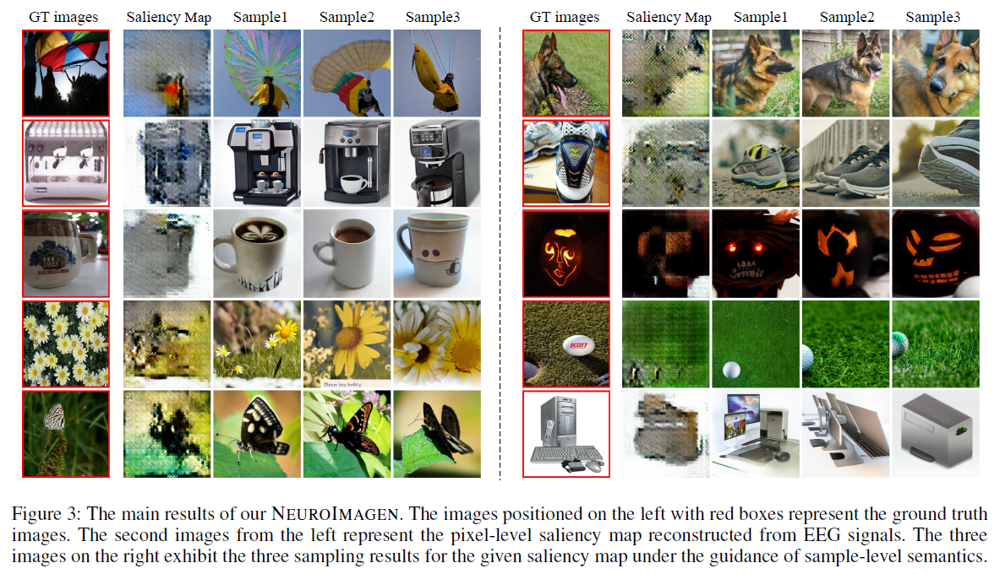
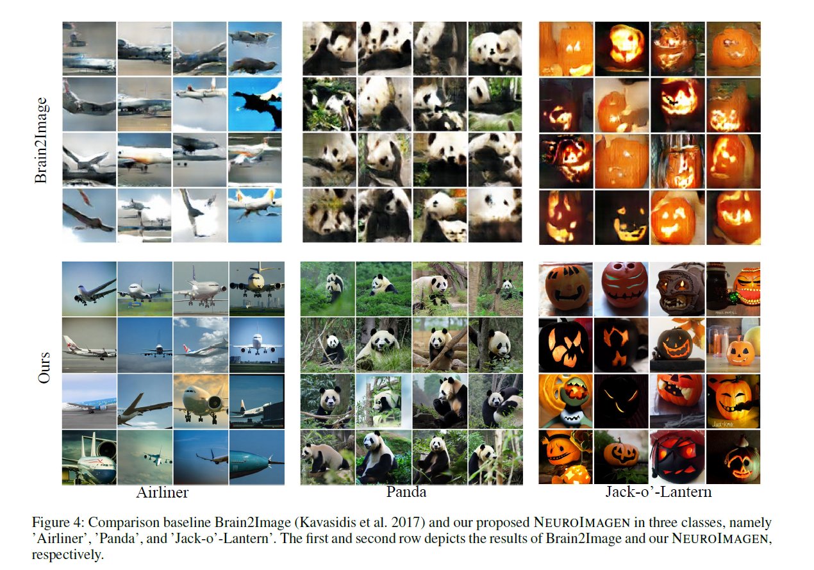
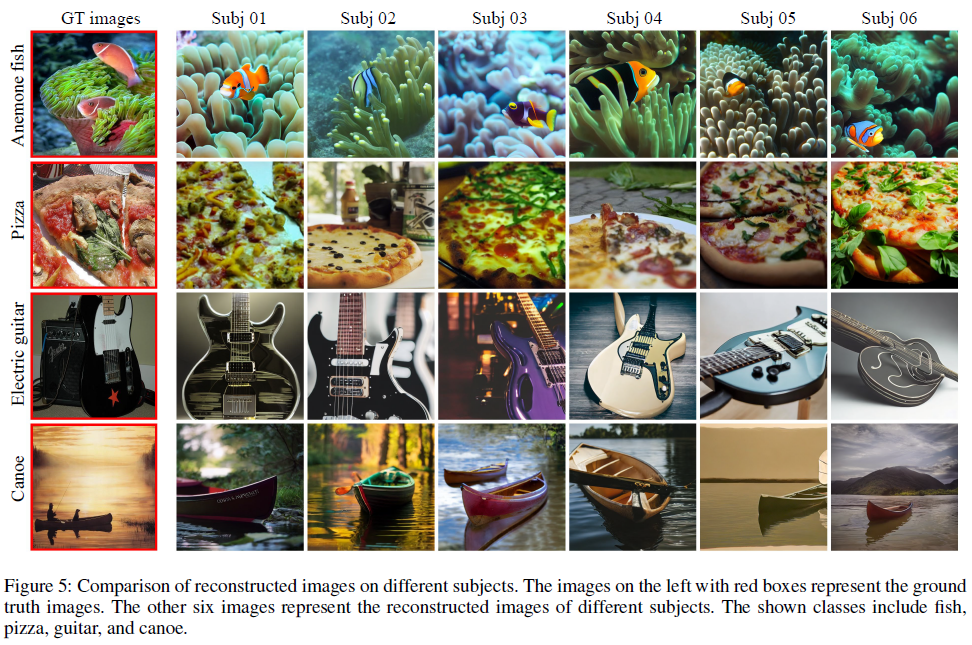

# Seeing through the Brain: Image Reconstruction of Visual Perception from Human Brain Signals

---

## 🔥INFO

**Blog**: 2025/07/22 by IgniSavium

- **Title**: Seeing through the Brain: Image Reconstruction of Visual Perception from Human Brain Signals
- **Authors**: Yu-Ting Lan,Wei-Long Zheng  et al. (SJTU)
- **Published**: August 2023
- **Comment**: arxiv
- **URL**: https://arxiv.org/abs/2308.02510

🥜**TLDR**: EEG2img Reconstruction Using the Stable Diffusion Framework: Transforming EEG Signals into Fine-Granularity **Image Silhouette Saliency Maps** and Coarse-Granularity CLIP Text Embeddings for Descriptions.

---

## Motivation

This research addresses the challenge of reconstructing high-resolution visual stimuli from EEG signals, a task complicated by the temporal nature and noise of EEG data, and improves upon previous approaches by introducing a multi-level (actually 2-level) semantic decoding method that enhances image quality and semantic accuracy, filling the gap left by earlier methods that either struggled with low resolution or failed to capture semantic details.

## Model

### Pixel-Level gran.

First, train a simple **EEG feature** extractor by **clustering** (a: anchor; p: positive ; n: negative):

Next, train a **GAN saliency map generator** (using $ f_\theta $ above as input):

ms: mode seeking regularization ; SSIM: structural similarity index measure

### Sample-Level gran.

transform EEG signal to corresponding description CLIP text embeddings using L2 loss.

## Evaluation

### Qualitative Results

### Performance

IS: Inception Score

### Cross-Subject Consistency

🤔As having incorporated all-subject data in the training set, this Cross-Subject Consistency experiment is *somehow pointless*.

### Ablation

Insufficient visual structural information (saliency map in this case) has become **a drag on** for more informative captions (BLIP caption vs. simple label caption in this case).

## 🤔Reflections

The feature extractor for EEG signals is poorly trained, resulting in GAN-generated saliency maps that are derived from ambiguous EEG features. These maps are highly inadequate for capturing the overall visual structure of the original image, including attributes such as position, size, and orientation.

An alternative approach is to directly map EEG signals into the latent space of the DM (e.g., the latent states encoded from the original images) [already utilized by Yu Takagi and Shinji Nishimoto]. 