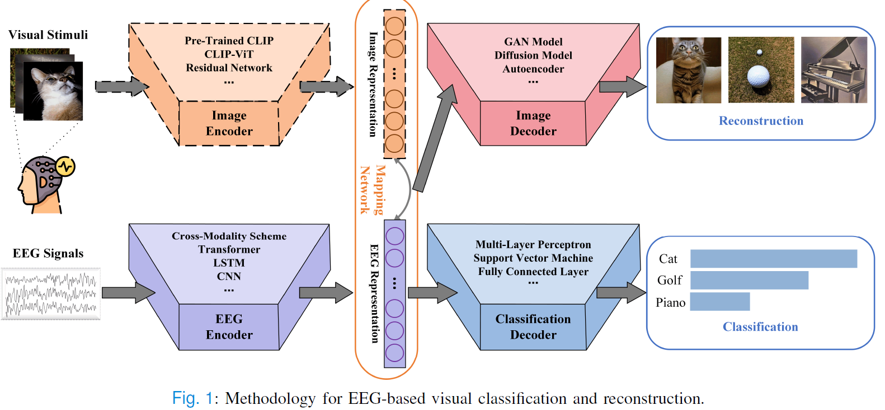
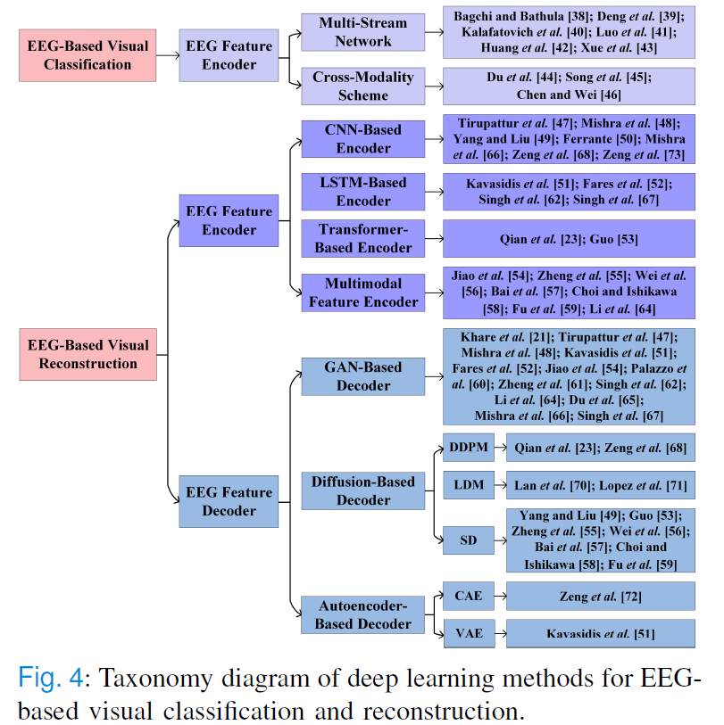

# Deep Learning for EEG-Based Visual Classification and Reconstruction: Panorama, Trends, Challenges and Opportunities

---

## 🔥INFO

**Blog**: 2025/07/17 by IgniSavium

- **Title**: Deep Learning for EEG-Based Visual Classification and Reconstruction: Panorama, Trends, Challenges and Opportunities
- **Authors**: Wei Li, Penglu Zhao, Cheng Xu, Yingting Hou, and Aiguo Song ( Southeast University)
- **Published**: May 2025
- **Comment**: IEEE Transactions on Biomedical Engineering
- **URL**: https://ieeexplore.ieee.org/document/10993346

🥜**TLDR**: This paper provides the first review on EEG-based visual classification and reconstruction, comprehensively summarizing the representative deep learning methods from both feature encoding and decoding perspectives.

---

##  Comparison with previous surveys

This review highlights EEG-based visual classification and reconstruction using deep learning, distinguishing itself from prior works in several ways:

- **Robinson et al.** focus on theoretical neural decoding, especially cognitive processes, but do not cover practical applications like image reconstruction. 
- **Wang et al.** center on GANs for EEG signal processing tasks like data augmentation and artifact removal (method-oriented perspective). 
- **Rakhimberdina et al.** explore deep learning for fMRI-based image reconstruction. However, EEG's high temporal resolution and low spatial fidelity pose different challenges.
- **Huang et al.** focus on fMRI-based visual decoding, whereas EEG faces more severe domain gap issues, which are a central concern of this review due to its temporal resolution and data variability.
- **Nestor et al.** discuss face image reconstruction from fMRI and behavioral data.

Overall, this review fills gaps by addressing **EEG**-specific challenges and offering a broader, **task-focused** perspective compared to existing surveys.

## Methods Summary

Generally utilize an **Encoder-Decoder** architecture.

