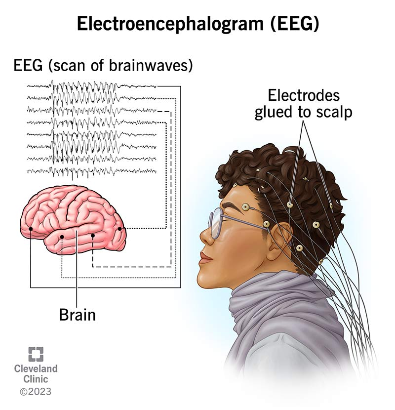

# Brainwaves to Pixels: Notes on EEG-Based Image Reconstruction 

## About

Hi~😉 I’m Ignisavium, a student passionate about EEG-based image reconstruction. These notes are part of my ongoing effort to organize and share knowledge on this fascinating topic. Feel free to explore my work or contribute on GitHub: [@ignisavium ](https://github.com/ignisavium). 

### Key Topics Covered

- 🧠**Introduction**: Basics of EEG and image reconstruction techniques. ([EEG itself](Where Does EEG Come From and What Does It Mean.md); [Diffusion Model Intro](https://arxiv.org/pdf/2403.18103)
- 📘**Papers & Methods**: Insights from seminal studies and algorithms.
- 🤔**Reflections **: Limitations and future directions in the field.

In recent years, **Diffusion Model** has gradually become the mainstream of generative models due to its excellent performance and convenient integration features. Here we mainly focus on the **EEG to Image reconstruction** method based on diffusion.

## Paper Compilation

This is a summary of cutting-edge work in recent years.

### EEG-based Image Reconstruction

| 时间 | 标题                                                         |
| ---- | ------------------------------------------------------------ |
| 2210 | Decoding Visual Neural Representations by Multimodal Learning of Brain-Visual-Linguistic Features |
| 2211 | High-resolution image reconstruction with latent diffusion models from human brain activity |
| 2211 | Seeing beyond the brain：Conditional diffusion model with sparse masked modeling for vision decoding |
| 2212 | NeuroGAN：image reconstruction from EEG signals via an attention-based GAN |
| 2302 | EEG2IMAGE：Image Reconstruction from EEG Brain Signals       |
| 2303 | DCA：A dual conditional autoencoder framework for the reconstruction from EEG into image |
| 2303 | High-resolution image reconstruction with latent diffusion models from human brain activity |
| 2303 | MindDiffuser：Controlled Image Reconstruction from Human Brain Activity with Semantic and Structural Diffusion |
| 2303 | [Apdx]High-resolution image reconstruction with latent diffusion models from human brain activity |
| 2305 | Reconstructing the Mind's Eye：fMRI-to-Image with Contrastive Learning and Diffusion Priors |
| 2306 | DreamDiffusion：Generating High-Quality Images from Brain EEG Signals |
| 2306 | Improving visual image reconstruction from human brain activity using latent diffusion models via multiple decoded inputs |
| 2308 | Decoding Natural Images from EEG for Object Recognition      |
| 2308 | Seeing through the Brain：Image Reconstruction of Visual Perception from Human Brain Signals |
| 2308 | UniBrain：Unify Image Reconstruction and Captioning All in One Diffusion Model from Human Brain Activity |
| 2309 | Decoding visual brain representations from electroencephalography through Knowledge Distillation and latent diffusion models |
| 2309 | DM-RE2I：A framework based on diffusion model for the reconstruction from EEG to image |
| 2310 | DM-RE2I：A framework based on diffusion model for the reconstruction from EEG to image |
| 2310 | Learning Robust Deep Visual Representations from EEG Brain Recordings |
| 2310 | Learning_Robust_Deep_Visual_Representations_From_EEG_Brain_Recordings_WACV_2024_paper |
| 2312 | BrainVis：Exploring the Bridge between Brain and Visual Signals via Image Reconstruction |
| 2401 | Visual image reconstruction based on EEG signals using a generative adversarial and deep fuzzy neural network |
| 2402 | MambaMIR：An Arbitrary-Masked Mamba for Joint Medical Image Reconstruction and Uncertainty Estimation |
| 2402 | Next Generation Imaging in Consumer Technology for ERP Detection-Based EEG Cross-Subject Visual Object Recognition |
| 2403 | Reconstructing Visual Stimulus Representation From EEG Signals Based on Deep Visual Representation Model |
| 2403 | Semantics-Guided Hierarchical Feature Encoding Generative Adversarial Network for fMRI2img |
| 2403 | Visual Decoding and Reconstruction via EEG Embeddings with Guided Diffusion |
| 2403 | Visual Decoding and Reconstruction via EEG                   |
| 2404 | A New Framework Combining Diffusion Models and the Convolution Classifier for Generating Images from EEG Signals |
| 2404 | Neuro-Vision to Language：Enhancing Brain Recording-based Visual Reconstruction and Language Interaction |
| 2405 | A New Framework Combining Diffusion Models and the Convolution Classifier for Generating Images from EEG Signals |
| 2406 | Autoregressive Model Beats Diffusion：Llama for Scalable Image Generation |
| 2406 | Evaluating the Feasibility of Visual Imagery for an EEG-Based Brain–Computer Interface |
| 2406 | Evaluating the Feasibility of Visual Imagery for an EEG-Based Brain–Computer Interfacepfd |
| 2406 | Mind's Eye：Image Recognition by EEG via Multimodal Similarity-Keeping Contrastive Learning |
| 2407 | EidetiCom：A Cross-modal Brain-Computer Semantic Communication Paradigm for Decoding Visual Perception |
| 2407 | Image classification and reconstruction from low-density EEG |
| 2407 | MB2C：Multimodal Bidirectional Cycle Consistency for Learning Robust Visual Neural Representations |
| 2409 | BrainDecoder：Style-Based Visual Decoding of EEG Signals     |
| 2410 | NECOMIMI：Neural-Cognitive Multimodal EEG-informed Image Generation with Diffusion Models |
| 2410 | Research on Brain Visual Image Signal Recognition Method Based on Deep Neural Network |
| 2412 | CognitionCapturer：Decoding Visual Stimuli From Human EEG Signal With Multimodal Information |
| 2505 | Deep Learning for EEG-Based Visual Classification and Reconstruction：Panorama, Trends, Challenges and Opportunities |
| 2505 | [Survey] Visual Image Reconstruction from Brain Activity via Latent Representation |
| 2507 | [Survey] Interpretable EEG-to-Image Generation with Semantic Prompts |

### Diffusion Model

| 时间 | 标题                                                         |
| ---- | ------------------------------------------------------------ |
|      | Tutorial on Diffusion Models for Imaging and Vision          |
|      | [DDPM]Denoising Diffusion Probabilistic Models               |
|      | [Score Matching]Score-Based Generative Modeling through SDEs |
|      | [Stable Diffusion]High-Resolution Image Synthesis with Latent Diffusion Models |
| 2105 | Diffusion Models Beat GANs on Image Synthesis                |
| 2211 | Versatile diffusion：Text, images and variations all in one diffusion model |
| 2308 | IP-Adapter：Text Compatible Image Prompt Adapter for Text-to-Image Diffusion Models |
| 2310 | Language Model Beats Diffusion -- Tokenizer is Key to Visual Generation |
| 2406 | Autoregressive Model Beats Diffusion：Llama for Scalable Image Generation |

## 
